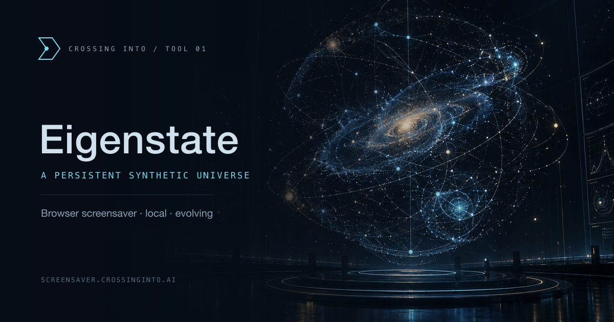
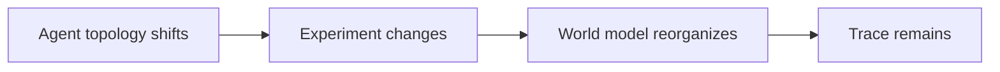

<p align="center">
  <a href="https://screensaver.crossinginto.ai"></a>
</p>

<p align="center">
  <a href="https://screensaver.crossinginto.ai"><strong>Enter Eigenstate</strong></a> ·
  <a href="#why-eigenstate">Why Eigenstate?</a> · <a href="#world-view-and-display-care">World view</a> · <a href="#sound">Sound</a> · <a href="#controls">Controls</a> ·
  <a href="#run-locally">Run locally</a> · <a href="#privacy">Privacy</a>
</p>

# Eigenstate

A browser screensaver with a memory. Open it, enter fullscreen, and watch a synthetic universe evolve. Agents reorganize, experiments change, and the world model shifts in response. Topology changes leave a trace. Close the tab and return later: the universe resumes with its identity intact and elapsed time reconciled.

Eigenstate is a browser screensaver for entertainment only. All agents, terminal logs, and metrics are simulated. It performs no real AI inference or quantum computation. The numbers describe its own synthetic simulation; they are not measurements of your computer or private reasoning traces.

## Why Eigenstate?

In quantum physics, an **eigenstate** is a state with a definite value for a particular measurable property, called an *observable*. Energy and a component of spin are examples of observables. If a system is in an eigenstate of an observable, an ideal measurement of that observable returns its associated *eigenvalue* with certainty.

The mathematical definition is:

$$
\hat{A}|\psi\rangle = a|\psi\rangle
$$

Here, $\hat{A}$ is the operator representing the observable, $|\psi\rangle$ is the eigenstate, and $a$ is the eigenvalue. Applying the operator to this state vector is equivalent to multiplying it by a number. The state and the measurement result are different things: the eigenstate describes the system; the eigenvalue is the value that measurement returns. See [MIT's notes on observables and uncertainty](https://ocw.mit.edu/courses/8-05-quantum-physics-ii-fall-2013/005979fa741c3ea2e0430456b70caf93_MIT8_05F13_Chap_05.pdf).

A qubit gives a concrete example. The states $|0\rangle$ and $|1\rangle$ are eigenstates of the Pauli-Z operator, with eigenvalues +1 and −1. A computational-basis measurement records these as the bit labels 0 and 1, respectively. A qubit prepared in $|0\rangle$ therefore gives 0 with certainty. The equal superposition $(|0\rangle + |1\rangle)/\sqrt{2}$ gives either bit with 50% probability. [IBM's qubit measurement guide](https://quantum.cloud.ibm.com/docs/en/guides/measure-qubits) explains this measurement basis.

Being an eigenstate depends on the observable. That same equal superposition is an eigenstate of Pauli-X, even though its Z-basis result is uncertain. The term does not mean that every property is definite or that the system is frozen.

For this screensaver, the name is an artistic reference to a state revealed through its observables. The panes show different aspects of one shared universe. Agent changes affect experiments, experiments reshape the world model, and those changes leave traces. Its persistent identity and visible history give you something to recognize when you return. These are rules of the browser simulation; its quantum labels and probability displays make no claim to physical quantum behavior.

Click **Why Eigenstate?** beneath the title for the in-app explanation. Close it with Escape, Q, the close button, or a click outside the dialog.

## Inside the observatory

| View | What happens |
| --- | --- |
| World model | 144 latent vectors orbit within instrument rings; experiment changes light up their associated points. |
| Agent topology | Dependency links carry signals. Confidence rings and causal highlights show which agents changed. |
| Branch exploration | Seven experiment paths carry packets, weighted by compute allocation. Entropy and confidence retain their history. |
| Quantum state | Eight synthetic basis phases move around a projection beside their probabilities. |
| Inference | Layer activations, token counts, throughput, and routing evolve with the universe. |
| Experiment registry | Convergence, assignments, model specifications, and up to 48 retained causal traces share one state. |
| Runtime terminal | Subsystem readings stream into a bounded log, with occasional typewriter reveals. |



Press **F** for fullscreen, **T** to find your palette, and **D** for sound. Settings offers quiet updates and optional simulated crashes that archive one universe before starting another.

## World view and display care

Press **W** or choose **World view** beside the fullscreen button to expand the world model across the browser viewport. Pane borders, typography, and the corner matrix disappear. The model keeps its rotating geometry, moving signals, and experiment highlights, with slow position and scale changes. Press W again, move the pointer, tap, or press another key to return to the dashboard. Use F to hide browser controls as well.

World view also starts after 60–75 seconds without input. A world reorganization can trigger it after one minute; otherwise it starts at 75 seconds. Each world scene lasts three minutes, followed by a 45-second dashboard visit. Desktop pane arrangements alternate between visits. Input restores your chosen layout, and open dialogs suspend idle mode. These timings use viewing time, independent of simulation speed.

Manual world view starts at normal brightness. After 75 seconds without input, the view gradually dims; automatic idle scenes start dimmer. Quiet updates, reduced motion, and paused views stop camera motion and fade world scenes to black over 30 seconds. Input restores normal brightness.

OLED burn-in is still possible. Moving scenes and dimming reduce static exposure but cannot guarantee protection or repair existing burn-in. Keep brightness low and leave your display's built-in panel care enabled. For long breaks, turn off **Keep screen awake** and allow display sleep. The settings dialog includes this caution beside the wake-lock control. See [Samsung's OLED panel-care guidance](https://www.samsung.com/us/support/troubleshoot/TSG10003240/).

## Run locally

Use Node.js 24.5 or newer and npm.

```sh
npm ci
npm run dev -- --port 5178
```

Open `http://127.0.0.1:5178/`. The development server updates the page as you edit. Development builds expand the diagnostics panel by default.

```sh
npm test          # Determinism, snapshots, migrations, recovery, lifecycle
npm run build    # Type-check, bundle, and generate the offline shell
npm run preview  # Preview the production build
```

Use HTTPS when hosting. Localhost is also a secure context for IndexedDB, Web Locks, cryptographic checksums, audio, and service workers. Current desktop browsers are the intended environment. Smaller screens use a stacked layout.

## Controls

| Key | Action |
| --- | --- |
| `F` | Enter or exit fullscreen |
| `W` | Start world view immediately, or return to the dashboard |
| `T` | Cycle themes, with a brief theme-name toast |
| `~` | Open the colophon |
| `D` | Toggle the soft ambient hum |
| `Space` | Pause or resume |
| `S` | Open settings |
| `?` or `H` | Show keyboard shortcuts |
| `Esc` | Close a dialog or exit fullscreen |
| `Q` | Close the colophon or shortcut dialog |

Controls remain available by mouse and touch. Shortcuts do not intercept typing, selectors, or dialogs. Space pauses even when a toolbar button is focused; Enter activates focused buttons. In a second tab, pause freezes that view while the writer tab keeps evolving. Fullscreen requires a click or keypress. The toolbar and cursor disappear after four idle seconds in fullscreen; moving the pointer reveals them.

Settings include layout, anomaly frequency, simulated crashes, quiet updates, optional screen wake lock, and universe export/import. Development builds also offer 1×, 10×, 100×, and 1000× speed, pause/resume, manual anomalies, and a crash preview that leaves the current universe intact. Acceleration applies to the visible session and resets to 1× on reload.

## Sound

Seven synthesized voices form a low foundation with a minor chord above it. Independent swells, slight pitch drift, and slow stereo movement keep the harmonics moving. Two quiet reflections add space. Simulation activity gently changes the filter, breathing rate, and level.

Sound starts off on every visit. Press **D** or enable **Settings → Ambient hum**, then adjust the volume. The default is 35%. Pausing or hiding the page suspends audio; the control reports playing, paused, muted, or blocked. Everything comes from Web Audio oscillators on your device, without recordings, remote samples, or microphone access.

### Binaural depth

With stereo headphones, enable **Settings → Binaural depth** to add a steady tone to each ear beneath the ambient layers:

| Left ear | Right ear | Frequency difference |
| :---: | :---: | :---: |
| 110 Hz | 116 Hz | 6 Hz |

The pair stays separate from the ambient panning, pitch drift, and echoes. Its intensity control sets the blend; hum volume, mute, pause, and hidden-page suspension still govern all sound. Both audio and binaural depth start off each visit, and their controls apply to the current session.

Use stereo headphones with mono audio disabled to preserve the separate signals. This is sound design for entertainment, with no claims of therapeutic effects or brain synchronization. Eigenstate is not affiliated with Hemi-Sync®.

## Themes

Eigenstate, Tokyo Night, Synthwave '84, Nord, and Catppuccin Mocha are available through the theme menu or `T`. Text, graphs, matrices, controls, and browser chrome use a shared palette registry. Themes change color without changing simulation state. No theme adds scanlines, CRT distortion, or phosphor glow.

Add a theme to `src/rendering/themes.ts`. Keep text readable against both panel and background colors, and include attribution for any adapted palette in `THIRD_PARTY_NOTICES.md`.

## Under the hood

Vue 3 · TypeScript · Canvas 2D · IndexedDB · Web Audio · Cloudflare Static Assets

<details>
<summary><strong>Architecture, persistence, simulated crashes, and recovery</strong></summary>

## Architecture

```text
src/core/
  types.ts           bounded universe and subsystem records
  random.ts          persisted Mulberry32 random state
  universe.ts        creation, identity, links, event recording
  engines.ts         agent, experiment, branch, quantum, inference, world engines
  anomalies.ts       events that alter actual simulated state
  simulation.ts      live advancement and elapsed-time reconciliation
  traces.ts          topology → experiment → world causal records
  runtime.ts         writer ownership, pause, lifecycle, checkpoint queue
src/persistence/
  snapshot.ts        validation, SHA-256 envelope, version migration
  store.ts           transactional IndexedDB storage and recovery
src/rendering/       Canvas projections and theme tokens
src/audio/           ambient synthesis and optional isolated binaural tones
src/components/     cached, independently refreshed canvas panes
src/App.vue          observatory, preferences, colophon, controls
scripts/build-sw.mjs versioned offline asset cache
```

All panes read one `Universe`. Agent dependencies produce graph edges; active and waiting agents determine experiment capacity; experiment convergence guides persisted world coordinates. Each topology change retains a bounded causal record linking agent event, experiment effect, and world-model displacement. The branch fan is a summary of seven experiments, not an explicit tree containing millions of branches. Model specification and trace panels display saved state and execute no code.

The simulation updates once a second while visible. Canvas panes render at up to 30 frames per second, with a slow camera orbit, drifting agent positions, signals along active dependencies, and interpolated quantum and inference values. These presentation effects never advance the simulation or its PRNG. Offscreen panes stop drawing. Quiet mode disables continuous motion and refreshes at most once every five seconds. The page stops its simulation timer when hidden and reconciles elapsed time on return. A service worker caches application assets; it does not run the simulation in the background.

The dashboard and expanded world view use the same renderer and share an animation clock, so switching views preserves camera rotation. Expanded views scale dots, glows, and strokes with model size, within fixed limits. Moving experiment highlights remain visible while labels and other fixed details are omitted. Hidden dashboard canvases stop drawing during world scenes; the universe continues evolving.

The runtime terminal streams one subsystem sample per simulation tick (every five seconds in quiet mode) alongside agent, experiment, and anomaly events. Every fifth incoming sample uses a brief typewriter reveal; event records arrive immediately. Typing stops while paused, hidden, or offscreen and is disabled in quiet mode. Its 80-line scrollback stays in memory. Scroll up to inspect earlier lines; select **Resume following** to return to the live tail. A compact world trace displays the current epoch, vector count, and coupling count. Pause freezes motion and streaming together.

## Simulated crashes

Occasionally the screensaver freezes, displays a fictional fault report, and counts down eight seconds before starting a new universe. The default interval is 45–90 minutes of active viewing, chosen from the universe seed. Settings also offers 10–20 minutes or Off. Paused and hidden time does not count; simulation speed does not shorten the interval. Quiet mode keeps the sequence free of motion and flashing.

Before restarting, Eigenstate saves the old universe and its replacement in one transaction. If that save fails, it keeps the current universe and disables crashes for the session. Automatic crashes require browser storage and writer ownership. Reloading during a pending crash restarts the countdown; another tab can finish it after taking ownership.

Only the most recent crashed universe is retained. **Settings → Export last crashed universe** downloads it. Import that file to restore it with a new crash grace period. Manual reset and import keep this archive; clearing site data removes it. Development builds include **Preview crash (no reset)** to inspect the screen without replacing any state.

## Persistence and continuity

State lives in the browser's IndexedDB database `eigenstate-v1`, within the current origin. The `state` store holds a current snapshot, previous checkpoint, last crashed universe, and at most three quarantined corrupt records. The `settings` store holds theme, layout, and quiet-mode preferences separately. For Matthew's deployment, the origin is `https://screensaver.crossinginto.ai`.

Each snapshot contains a version, JSON payload, and SHA-256 checksum. The payload holds universe identity, seed, PRNG state, elapsed age, entities, summary counters, bounded history, up to 48 causal traces, anomaly rate, optional crash frequency and remaining viewing time, and last wall-clock timestamp. No endless terminal transcript is stored.

Checkpoint writes replace the current state in one IndexedDB transaction every 15 seconds and when the page becomes hidden. The previous checkpoint is updated in the same transaction. Abrupt termination can lose up to one checkpoint interval of live detail; the next session reconciles the elapsed gap. Teardown is a best effort, not the only save mechanism.

On load, Eigenstate checks the checksum, format version, entity limits, references, vector dimensions, and numeric bounds. Version 1's `lastSavedAt` field migrates to `savedAt` with a default anomaly rate. Version 2 gains an empty causal trace ledger. A corrupt current snapshot is quarantined, then the previous checkpoint is tried. If neither loads, a new universe starts with a visible recovery notice. Unknown future versions are preserved without overwrite. Imports are size-limited, validated, and confirmed before replacement.

Web Locks permit only one tab at a time to write a universe. Other visible tabs follow checkpoints and can take over after the writer releases its lock. A hidden writer checkpoints and releases ownership. If safe persistence is unavailable, a visible notice explains that the session must be exported to keep it.

Browser storage is not a permanent backup. Request persistent storage from Settings; the browser decides whether to grant it. Site-data clearing, private browsing, browser policies, profile changes, or moving to another origin can remove or isolate state. Export your universe to keep a portable copy. Preview ports and production domains have separate universes.

## Time reconciliation

The same snapshot and elapsed duration produce the same result within a given engine version. A gap is divided into at most 96 analytical steps. Branch evaluation and task counts accumulate by rate, convergence uses exponential decay, and lifecycle events use seeded probabilities. Large intervals aggregate agent turnover and anomaly counts instead of creating unbounded records.

Ten hours offline therefore take bounded work, not 36,000 timer ticks. Year-scale tests keep the same universe identity. Different partitions of elapsed time are not guaranteed to produce identical paths, and floating-point math is not promised to match bit-for-bit across every JavaScript engine. Negative clock changes never reverse age or lower the saved wall-time marker. A defensive per-call duration bound of one trillion seconds prevents pathological inputs.

## Reset, export, and removal

Use **Settings → Export universe** to download a checksummed JSON snapshot. Importing a snapshot replaces the current universe after confirmation and reconciles its elapsed time.

**Reset universe** requires typing `RESET`. It atomically replaces the saved universe with a new identity and seed at age zero, and clears the previous checkpoint and corruption recovery history. The last crashed universe and theme preferences stay intact. Export before resetting if you want to keep the old universe.

An installed browser app can be removed through the browser's app-management interface. To remove saved state and the offline shell, clear site data for Eigenstate's exact origin. Uninstalling an app shortcut alone may leave that data in the browser. Eigenstate is an ambient fullscreen website; it does not register as a macOS screensaver or replace your lock screen.

</details>

## Cloudflare and Crossing Into

The included `wrangler.jsonc` serves `dist/` through Cloudflare Workers Static Assets with no backend. Matthew's configured custom domain is `screensaver.crossinginto.ai`. Change or remove the route before deploying your own copy.

The project has a $0 hosting budget. Builds run locally, and simulation and storage stay in the browser. Cloudflare currently lists static-asset requests as free and unlimited, with no additional asset-storage charge. No paid backend, API, or database is required. Check [Cloudflare's static-asset pricing](https://developers.cloudflare.com/workers/static-assets/billing-and-limitations/) before changing the hosting setup.

```sh
npx wrangler login
npm run deploy
```

This uploads the app and changes the configured deployment. The Cloudflare account must control the domain. An alternative is Cloudflare Pages with build command `npm run build` and output directory `dist`.

The companion listing lives in `crossinginto.ai/content/tools.md`. Deploy Eigenstate before publishing a listing that links to it. Both repositories build independently. Cloudflare hosting configuration follows the [Static Assets documentation](https://developers.cloudflare.com/workers/static-assets/) and [Custom Domains documentation](https://developers.cloudflare.com/workers/configuration/routing/custom-domains/).

## Privacy

Simulation and sound run on your device. Eigenstate has no accounts, analytics, API calls, or telemetry reporting. It does not inspect your files or hardware usage, execute shell commands, or upload universe state. Import reads only the JSON file you explicitly select.

The browser requests this site's static assets and checks its service worker for updates. Ordinary hosting access logs may exist at the hosting provider. Once the production shell is cached, the app can reopen offline. External links navigate only when selected. The app bundles its code and uses system fonts.

Production checks for updates on startup and once an hour. New assets download in the background without reloading open tabs or interrupting world view. An update notice asks you to reload when convenient. Local development can still reload the page when source files change.

## Colophon

Created by Matthew Williamson and GPT. Matthew sets the direction; GPT shares creative and technical decisions across the simulation, interface, sound, and implementation. The working agreement lives in [AGENTS.md](AGENTS.md); copyright and repository ownership remain with Matthew.

Part of [Crossing Into](https://crossinginto.ai). Open the in-app colophon with **~**. The banner above is promotional artwork; the live observatory renders its own simulation in Canvas.

## License

MIT License. Copyright (c) 2026 Matthew Williamson. See [LICENSE](LICENSE) and [THIRD_PARTY_NOTICES.md](THIRD_PARTY_NOTICES.md). This project has no affiliation with any film, television series, broadcaster, or streaming service.
